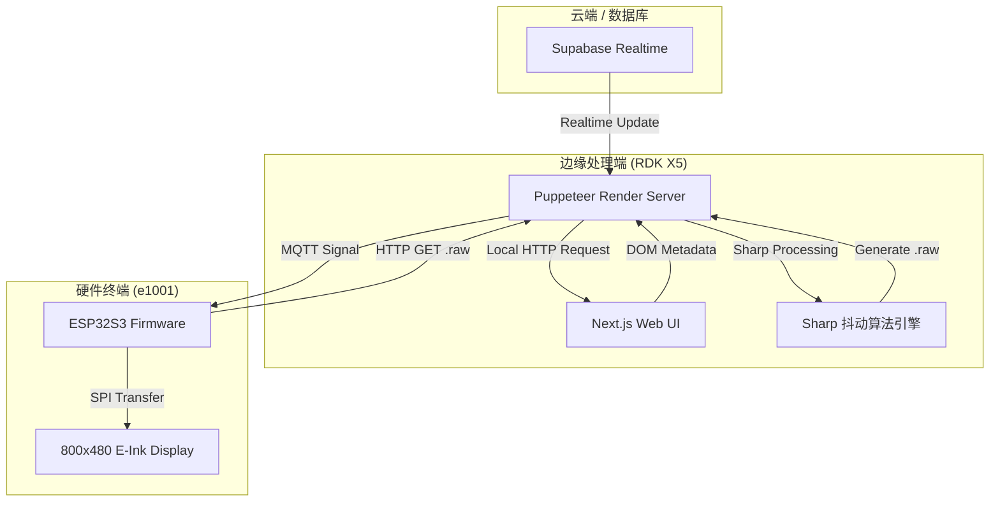

# e1001 E-Paper Sync: 核心架构设计与原理解析

本文档详细阐述了 e1001 电子纸同步方案的架构选型、数据流向及关键技术实现。

---

## 🏗 全局架构概览 (Overall Architecture)

本项目采用了 **“降维打击”与“极致解耦”** 的设计理念。

核心逻辑将资源受限的 **reTerminal E1001 (ESP32S3)** 抽象为一个简单的、可以通过网络接收位图流并推送到屏幕的 **“哑终端” (Dumb Display)**。所有的 UI 库解析、布局计算、图形渲染均由性能充沛的 **RDK X5 (边缘侧)** 承担。

### 核心分层图示 (System Layers)

---

## 🧪 核心渲染流水线 (SSR & Dithering)

### 1. 无头浏览器截屏 (Headless Capture)
利用 Node.js 调派 **Puppeteer**。当后台数据发生变化时，服务端启动一个虚拟浏览器实例，加载 Next.js 前端页面。
- **像素对齐**：`viewport` 被严格锁定为 `800x480`，确保 Web 布局与物理屏幕 1:1 映射。

### 2. 图像降维算法 (Image Processing)
截图产生的 32-bit 彩色 PNG 不能直接显示在墨水屏上。我们使用 **Sharp** 库配合 **Floyd-Steinberg 抖动算法**。
- **灰度转换**：先将图像转为 256 位灰阶。
- **抖动注入**：通过误差扩散（Error Diffusion），在只有黑白两色的 1-bit 屏幕上营造出细腻的过渡层次，有效模拟照片中的灰阶细节。

---

## 📡 通信链路设计 (Data Transfer)

本项目采用了“推拉结合”的稳健策略：

1.  **控制通道 (Push/MQTT)**：服务器渲染完成后，向 MQTT 代理发送一个包含下载 URL 的极小文本包。实时性强，功耗低。
2.  **数据通道 (Pull/HTTP)**：设备收到信号后，通过 HTTP 流式拉取（Stream-to-Screen） 48KB 的二进制 RAW 文件。这种方式支持较大的单帧数据下发，且比 MQTT 传输文件更稳定。

---

## 🔄 状态流转机制 (Handshake)

为了保证渲染出的画面“绝对完整”，系统在 Web 前端与后端之间加入了一个 **`__RENDER_READY__`** 信号握手。
- **前端工作**：在所有动画执行完毕、Supabase 数据挂载成功、DOM 稳定后，在 `window` 对象下设置标志位。
- **后端工作**：Puppeteer 会通过 `waitForFunction` 捕获该信号，待时机成熟后再按下“快门”。

---

## ⚖️ 方案权衡 (Trade-offs)

| 特性 | 本项目方案 (SSR) | 传统方案 (Data-Driven) |
| :--- | :--- | :--- |
| **UI 修改成本** | 极低：改一行 CSS 即可。 | 极高：需重新烧录 C++ 固件。 |
| **显示一致性** | 极高：网页显示什么样，屏幕就是什么样。 | 一般：取决于 MCU 的绘图库。 |
| **实时性** | 秒级 (2s~5s) 延迟。 | 毫秒级延迟。 |
| **带宽消耗** | 较高 (每张图约 48KB)。 | 极低 (仅几个字节的数据包)。 |

> [!TIP]
> **结论**：本架构最适合**“慢速监控屏”**场景（如餐厅菜单、会议室状态、环境信息面板），不推荐用于高频刷新的秒表或倒计时场景。
