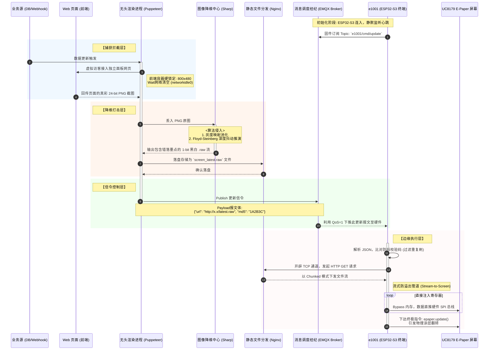

# MQTT 结合无头渲染 (SSR) 屏幕同步工作流剖析

本独立文档专门记载“基于事件驱动的流式屏幕同步架构”的核心工作流。该方案旨在通过 MQTT 通信协议与服务端的无头浏览器配合，完美跨越复杂前端渲染与单片机硬件限制的鸿沟。

---

## 一、 系统全链路时序拓扑

下方拓扑图严密定义了从数据库变更到最终电子墨水屏像素发生物理偏转的全部数据流向：

---

## 二、 阶段拆解与“哲学理念”

整个工作流践行了**“控制面与数据面分离”、“重算力前置”**的架构美学。

### 阶段 1：触发与捕获 (Trigger & Capture)
*   **动作**：一旦检测到数据变化，驻守云端的 Puppeteer 无头浏览器便作为“哨兵”拉起该终端对应的 Web 面板。
*   **高明点**：设置了严格的视窗规格锁定（与 e1001 一比一对应），从而完全释放了网页前端人员的设计束缚。它负责将各种 DOM 树、WebGL 图表进行冷酷定格。

### 阶段 2：图像特化降维 (Image Dithering)
*   **动作**：这是对 E-Paper 物理特性的直接妥协与利用。将 24 位全彩色图片利用 `Sharp` 图像操作库丢掉色彩特征，应用 `Floyd-Steinberg` 误差扩散矩阵。
*   **高明点**：该操作人为地在生硬像素间植入斑驳密布的黑白点阵，在墨水屏不具备真彩域的情况下，“伪造”出了平滑细腻的灰度过渡层次感，这是终端微控制器靠自身算力极难实时推演出的视觉盛宴。

### 3. 信令与多路下发 (Signaling Control via MQTT)
*   **动作**：服务器不会通过臃肿的 HTTP 或者直接的 TCP Socket 去盲推 40KB+ 的文件，而是聪明地发送了一张极小的 JSON "传票"（包含大文件所在的 URL 与内容特征标识）。
*   **高明点**：依靠 MQTT QoS 服务来完成“传票”的必定送达与离线暂存。这一举彻底解耦了文件分发的风险，即便同时面临 10,000 台 e1001 设备，系统也绝不在信令下发阶段产生资源瓶颈阻塞。

### 4. 终端流式直推 (Stream-to-Hardware Execution)
*   **动作**：边缘端的 e1001（ESP32-S3） 只是一个被拨动了琴弦的木偶。它循着“传票”地址发起下载，由于完整图像帧极有可能突破其可怜的可用 RAM，它选择利用 HTTP Client 的 Stream 能力，收到一小块 buffer 就通过 SPI 直接塞入驱动 IC 的显存缓冲区内。
*   **高明点**：绕开了 MCU 内存被占崩的风险极限，并在最后一步精确执行 `epaper.update()`，让复杂的云技术魔法收束于沉浸低噪的物理硬件动作上。
