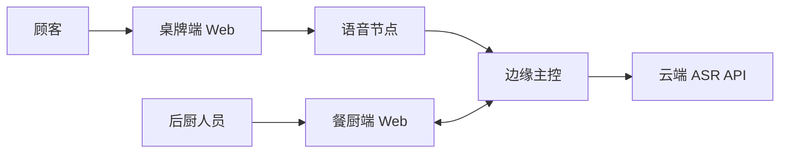
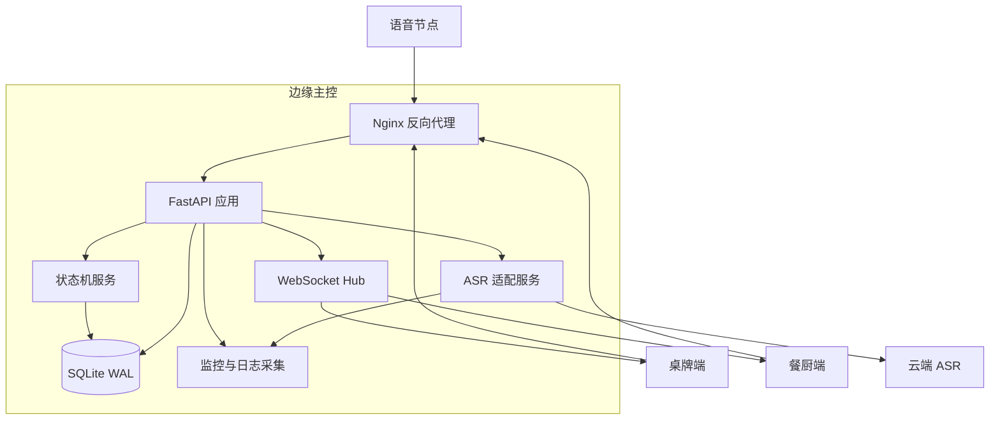
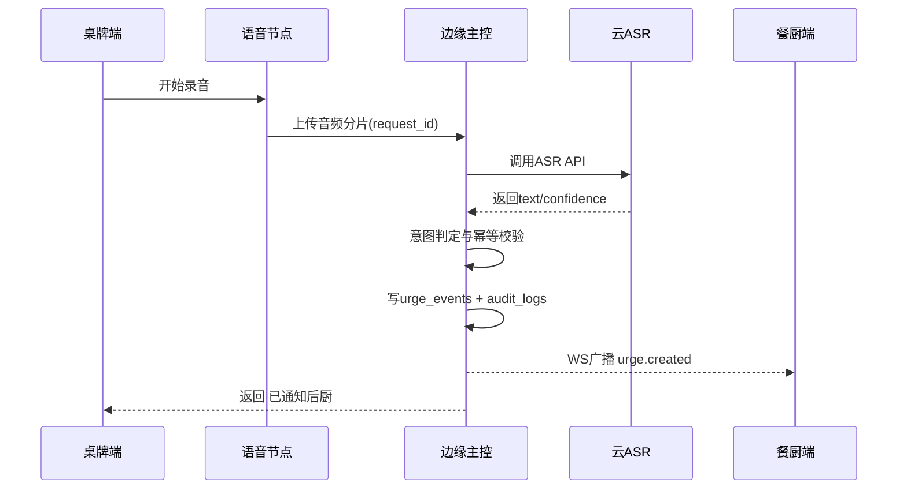

# 方案1技术架构（单云单活极速 MVP）

- 文档版本：v1.1
- 状态：评审中
- 对应 ADR：ADR-001
- 适用范围：单店试点，6 周上线窗口

## 1. 架构目标

1. 业务连续性优先
- 订单状态流转和多端同步为主链路，语音链路故障不得扩散到主链路。

2. 快速交付优先
- 保持单云单活和最小组件集，降低集成复杂度，确保按期上线。

3. 可演进优先
- 通过 ASR 适配层抽象，后续可平滑升级到双云热备。

## 2. 约束与边界

1. 业务约束
- 餐桌催单仅支持语音交互。
- 外网中断时语音不可用，但订单状态流转可用。

2. 技术约束
- ASR 推理全部走云端 API，不做本地 ASR 推理。
- 边缘主控是业务唯一事实源。

3. 数据边界
- 不保存原始音频，仅保存调用元数据和识别结果摘要。

## 3. 架构视图

### 3.1 上下文视图（Context）

### 3.2 容器视图（Container）

## 4. 组件职责与边界

1. 语音节点
- 仅负责采集、基础 VAD 截断和上传。
- 不负责意图识别和业务决策。

2. API 网关（Nginx + FastAPI）
- 统一鉴权、限流、路由和错误码规范。
- 处理订单状态变更、催单请求和快照同步。

3. 状态机服务
- 执行订单状态合法迁移。
- 通过 version 乐观锁保证并发一致性。

4. WebSocket Hub
- 负责实时事件广播与重连后增量补偿。
- 客户端按 event_id 去重。

5. ASR 适配服务
- 封装云 ASR 调用、超时、重试、错误码映射。
- 统一输出识别文本、置信度和耗时数据。

6. SQLite（WAL）
- 作为本地业务事实库，支持断电恢复和审计追踪。

## 5. 关键数据模型

1. orders
- 字段：order_id, table_id, current_state, version, created_at, updated_at。

2. urge_events
- 字段：event_id, order_id, table_id, source, confidence, request_id, created_at。

3. asr_calls
- 字段：call_id, request_id, provider, latency_ms, success, error_code, created_at。

4. audit_logs
- 字段：log_id, actor, action, payload, created_at。

## 6. 关键时序与异常分支

### 6.1 语音催单主时序

### 6.2 异常时序（超时/外网中断）

1. ASR 超时
- 云调用超时 1.2 秒，重试 1 次。
- 仍失败则返回语音失败提示，不写入催单事件。

2. 外网中断
- ASR 调用直接失败，返回语音不可用提示。
- 订单状态主链路和看板同步保持可用。

## 7. 接口契约基线

1. POST /api/v1/orders/{id}/state
- 入参：target_state, operator, version。
- 出参：订单最新快照。

2. POST /api/v1/orders/{id}/urge
- 入参：source=voice, request_id, confidence, asr_provider, asr_latency_ms。
- 幂等键：request_id。
- 出参：accepted, reason。

3. GET /api/v1/snapshot?since=timestamp
- 用途：弱网重连后的增量补偿。

4. WebSocket /ws/store/{store_id}
- 事件：order.updated, urge.created, device.offline, system.degraded。

## 8. 性能与容量设计

1. SLA 目标
- 状态变更到多端可见：P95 <= 200ms，P99 <= 500ms。
- 语音结束到后厨提醒：P95 <= 2.0s。

2. 容量假设
- 在线终端：20 台。
- 峰值吞吐：120 单每小时。
- 语音峰值并发：2 到 3 路。

3. 容量保护
- 单设备语音请求节流：30 秒仅允许 1 次有效催单。
- WebSocket 心跳：10 秒，连续丢失 3 次判离线。

## 9. 可靠性与降级

1. 设计原则
- 语音链路可降级，主业务链路不可降级。

2. 降级策略
- 高噪声：低置信度不触发催单，提示靠近麦克风重试。
- ASR 超时：单次重试后失败，提示联系服务员。
- 外网中断：语音不可用，保持状态流转与看板同步。

3. 数据恢复
- SQLite WAL 模式，断电恢复目标 RTO <= 60 秒。

## 10. 安全与合规

1. 身份与访问
- 设备采用预共享 token + 设备 ID 白名单。
- 管理操作写入审计日志。

2. 密钥管理
- 云 ASR Key 存储在本地安全区，按月轮换。
- 禁止将密钥写入仓库和明文配置。

3. 数据最小化
- 不保存原始音频。
- 日志仅保留必要字段并脱敏。

## 11. 可观测性与告警

1. 指标体系
- 业务指标：催单成功率、催单处理时延。
- 技术指标：ASR 成功率、ASR P95 延迟、WS 在线连接、设备离线率。
- 成本指标：日调用量、单次调用成本、日费用。

2. 告警阈值
- ASR 成功率 < 90% 持续 10 分钟。
- 语音链路 P95 > 2.0 秒持续 5 分钟。
- 设备离线率 > 20% 持续 10 分钟。

3. 追踪要求
- 每次请求打通 request_id，支持从桌牌到后厨的全链路追踪。

## 12. 部署与发布策略

1. 单机部署基线
- systemd 管理进程。
- 启动顺序：DB -> API -> WS -> ASR 适配。

2. 发布策略
- 低峰灰度发布。
- 发现主链路异常立即回滚。

3. 回滚策略
- 应用版本回滚 + 配置回滚双通道。
- 回滚后优先验证主链路再验证语音链路。

## 13. 验收检查清单

1. 功能验收
- 语音催单主流程通过。
- 低置信度、超时、外网中断分支通过。

2. 性能验收
- 同步和语音 SLA 达标。

3. 稳定性验收
- 20 终端并发 30 分钟无状态错乱。
- 断电恢复和重连补偿通过。

4. 运维验收
- 监控、告警、日志检索、回滚演练完成。

## 14. 演进路线

1. 演进触发条件
- 门店规模扩大或单供应商稳定性无法满足目标。

2. 演进方向
- 保持 ASR 适配层不变，升级到双云热备（方案2）。
